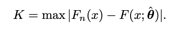

# pldis R Package

<!-- badges: start -->
[](https://github.com/njerezlillo/pldis/actions/workflows/R-CMD-check.yaml)
[](./LICENSE)

<!-- badges: end -->

This package offers a collection of tools for fitting the discrete power-law model, using either the ordinary maximum likelihood estimator (MLE) or a discrete Fisher-penalized MLE (Firth-type bias reduction). The package includes:

- Log-likelihood: Calculates the log-likelihood function for the discrete power-law model.
- Fisher-type penalty: Computes the Firth-type bias-reduction penalty derived from the Fisher information of the discrete power-law model.
- Fisher-penalized log-likelihood: Computes the penalized log-likelihood obtained by adding the Fisher-type penalty to the ordinary log-likelihood.
- Fitting: Provides methods for estimating model parameters, with the option to apply either the ordinary MLE or the Fisher-penalized MLE.

## Progress status

- [x] Set up the package structure  
- [x] Write functions  
- [x] Document functions
- [x] Write examples for each function in the package
- [x] Check the documentation
- [x] Publish on GitHub  
- [x] Complete the "Example" section on GitHub
- [ ] Distribute on CRAN

## Installation

You can install the package using :

``` r
# install.packages("devtools")
devtools::install_github("njerezlillo/pldis")
```

## Example

This section presents a concise example illustrating the use of the main functions of the package.

We begin by defining a dataset of 13 observations:

``` r
library(pldis)

x <- c(1, 1, 2, 2, 2, 2, 2, 3, 3, 3, 4, 4, 10)
```

Next, we estimate the discrete power-law model for the dataset `x` using the `fit_pldis` function with both estimators to compare the results. The argument `xm = 1` specifies that the lower bound is fixed at 1. Consequently, the function returns the estimated scaling parameter under both estimation methods:

``` r
fit_pldis(x, xm = 1, penalized = FALSE) # ordinary MLE
fit_pldis(x, xm = 1, penalized = TRUE)  # discrete Fisher-penalized MLE
```

In many contexts, the power-law model does not apply to the entire dataset, but rather holds starting from a certain lower bound. Therefore, we aim to determine the threshold that ensures the best fit between the observed data and the power-law model. Specifically, this threshold is chosen so that the cumulative distribution function of the observed data is as similar as possible to the cumulative distribution function of the fitted power-law model. This alignment is assessed using the Kolmogorov-Smirnov statistic  (see Clauset *et. al.* 2009 for details).

<p align="center">
  
</p>

Our function allows this threshold to be estimated automatically by omitting the `xm` argument. In this case, the function selects the lower bound that best fits the model while estimating the scaling parameter using either estimator:

``` r
fit_pldis(x, penalized = FALSE) # ordinary MLE
fit_pldis(x, penalized = TRUE)  # discrete Fisher-penalized MLE
```

## Citation

To cite `pldis` package in publications, please use the following format:

Jerez-Lillo N (2026). *pldis: Fitting Discrete Power-Law Model*. R package version 1.0.0, [https://github.com/njerezlillo/pldis](https://github.com/njerezlillo/pldis).

For LaTeX users, the corresponding BibTeX entry is:

```bibtex
@Manual{
  title = {pldis: Fitting Discrete Power-Law Model},
  author = {Nixon Jerez-Lillo},
  year = {2026},
  note = {R package version 1.0.0},
  url = {https://github.com/njerezlillo/pldis},
}
```

## Foundational References  

> **Bias Reduction and Goodness-of-Fit in Discrete Power-Law Models**  
> Jerez-Lillo, N., Rodrigues, F. A., Ferreira, P. H., and Ramos, P. L.  
> *Submitted for publication.*

> [**Bias reduction of maximum likelihood estimates**](https://doi.org/10.1093/biomet/80.1.27)  
> *Firth D.*  
> Biometrika, 80(1), 27–38 (1993)

> [**Power-law distributions in empirical data**](https://doi.org/10.1137/070710111)  
> *Clauset A., Shalizi C. R., Newman M. E. J.*  
> SIAM Review, 51(4), 661–703 (2009)
